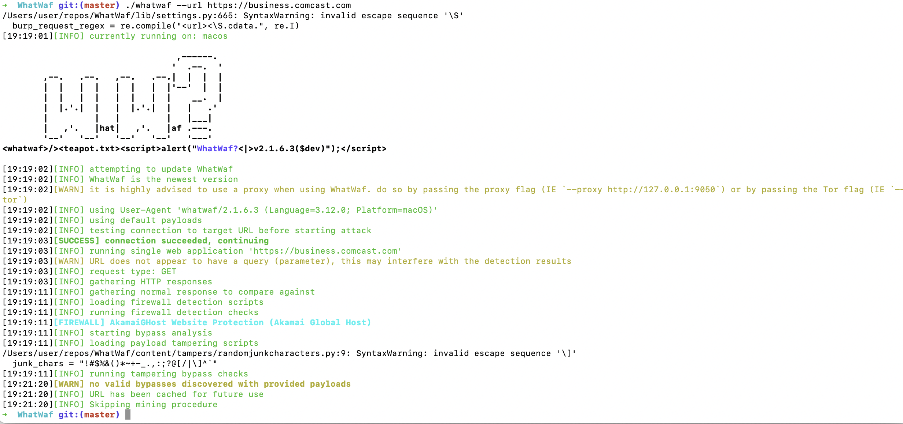

# United Master Service Project

This project provides a service for managing United Master-related operations. It includes both browser-based and HTTP-based methods for interacting with the United Master platform.

## Current Status

### Browser-Based Method
The browser-based method is fully functional and allows seamless interaction with the United Master platform. It handles tasks such as navigation, login, and button interactions effectively. This method leverages the `botasaurus` library for browser automation.

### HTTP-Based Method
The HTTP-based method is currently under development. While we have successfully solved CAPTCHA challenges using the `capsolver_service`, we are encountering issues with Firebase App Check validation. It appears that Firebase is performing additional header checks, which are blocking our HTTP requests. Further investigation and debugging are required to overcome this challenge.

## Project Structure

- `united_master_service.py`: Contains the core logic and functionality for interacting with the United Master platform.
- `united_master_browser.py`: The main entry point for running the United Master service.
- `united_master_http.py`: Unfinished http implementation of the login
- `README.md`: Documentation for the project.

## Prerequisites

- Python 3.12 or higher
- Required Python packages (see below for installation)

## Setup

1. Clone the repository:
   ```bash
   git clone 
   cd comcast
   ```

2. Install dependencies:
   ```bash
   pip install -r requirements.txt
   ```

   The `requirements.txt` file includes the following dependencies:

   - `botasaurus==4.0.74`: A library for browser automation, used extensively in this project for web scraping and interaction.
   - `python-dotenv==1.0.1`: A library for loading environment variables from a `.env` file, ensuring sensitive information like usernames and passwords are securely managed.
   - `curl_cffi`: A library for making HTTP requests with advanced features like retries and proxy support.
   - `capsolver_service`: A service for solving CAPTCHA challenges.

3. Set up your `.env` file with the following environment variables:
   - `UNITED_MASTER_USERNAME`
   - `UNITED_MASTER_PASSWORD`
   - `RESIDENTIAL_PROXY`

   Example `.env` file:
   ```
   UNITED_MASTER_USERNAME=your_username
   UNITED_MASTER_PASSWORD=your_password
   RESIDENTIAL_PROXY=http://your_proxy
   ```

4. Run the browser-based method:
   ```bash
   python united_master_browser.py
   ```

The HTTP method is implemented in the file united_master_http, still not yet able to get through, i think its due to Firebase headers checks which gets generated dynamically in the browser

## Insights on Website Protection

The United Master platform employs Firebase App Check validation as part of its security measures. This adds an additional layer of complexity for HTTP-based interactions. While CAPTCHA challenges can be solved, the Firebase App Check validation currently blocks our HTTP requests. This highlights the importance of understanding and addressing advanced security mechanisms when developing automated solutions.


# Comcast Service Project

This project provides a service for managing Comcast-related operations. It includes a Python-based implementation with modular components for service logic and a main entry point for execution.

## Insights on Website Protection

The website being interacted with in this project is protected by Akamai's advanced anti-bot firewall. This adds an additional layer of security, making it challenging to perform automated tasks without proper handling. Below is a proof image showcasing the Akamai anti-bot firewall in action:




## Project Structure

- `comcast_service.py`: Contains the core logic and functionality of the Comcast service.
- `main.py`: The main entry point for running the service.
- `README.md`: Documentation for the project.

## Prerequisites

- Python 3.12 or higher (a test on 3.12 was made)
- Required Python packages (see below for installation)

## Setup

1. Clone the repository:
   ```bash
   git clone <repository-url>
   cd comcast
   ```

2. Install dependencies:
   ```bash
   pip install -r requirements.txt
   ```

   The `requirements.txt` file includes the following dependencies:

   - `botasaurus==4.0.74`: A library for browser automation, used extensively in this project for web scraping and interaction.
   - `python-dotenv==1.0.1`: A library for loading environment variables from a `.env` file, ensuring sensitive information like usernames and passwords are securely managed.

   To install these dependencies, run:
   ```bash
   pip install -r requirements.txt
   ```

3. You also need to set these ENVs in your `.env` file:

- `RESIDENTIAL_PROXY`: The proxy server address for residential IPs.
- `USERNAME`: Your username for authentication.
- `PASSWORD`: Your password for authentication.

## Usage

Run the service using the `main.py` file:
```bash
python ./main.py
```

## Features

- Modular design for Comcast service logic.
- Easy-to-use entry point for running the service.
- Anti Bot systems aware

## License

This project is licensed under the MIT License. See the `LICENSE` file for details.

---

Feel free to reach out for any questions or issues!